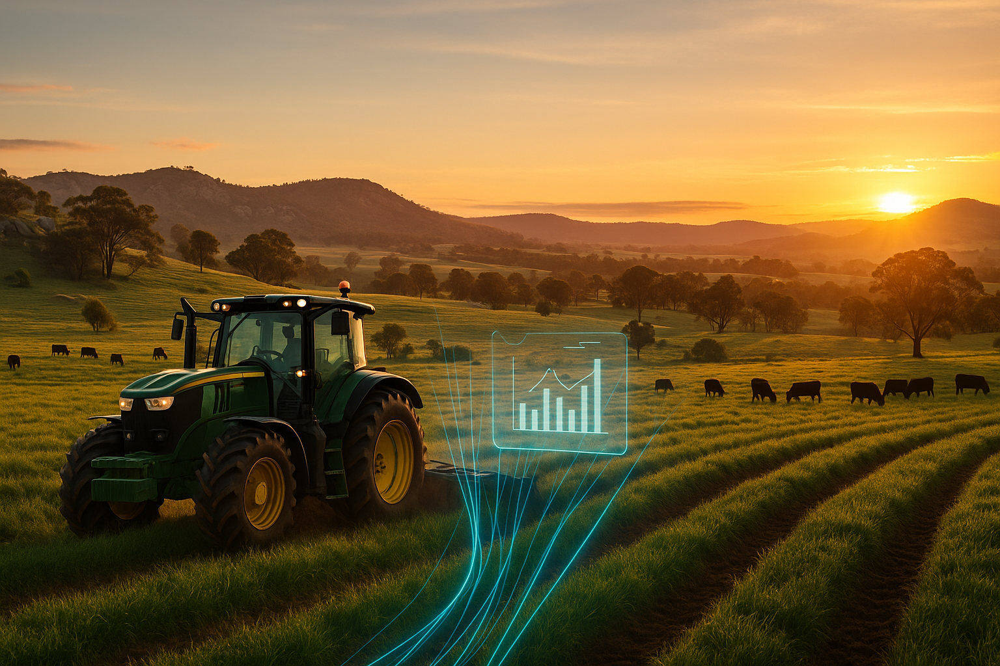

# LLM Prompts Repository

This repository contains curated prompts for image generation (and potentially other LLM uses).  
Each prompt includes:
- **Prompt text** (Markdown or plain text)
- **Generated image(s)**
- **Metadata** (tool used, style, tags, notes)

---

## 📂 Catalogue

### Regional AI
- [Regional AI – Example 1](./images/regionalAI/regionalAI1.md)  
  

---

## 🔖 Tags & Themes
- `#regionalAI` – prompts focusing on regional innovation and AI in agriculture.  

---

## 🛠 How to Use
1. Browse the catalogue above and open the Markdown file for any example.  
2. Copy the **Prompt** section into your LLM/image generator.  
3. Adjust parameters as needed for your own use.

---

## ✅ Contributing
If you add new prompts:
- Save them in a dedicated folder under `images/[theme]/`.  
- Include both `.md` (prompt + image + notes) and `.png` (or `.jpg`).  
- Update this `README.md` with a link and small preview.
