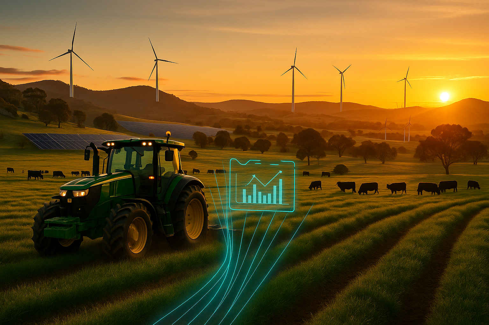

# Regional AI – Example 1

## Metadata
- **Date created:** 2025-08-21  
- **Model/tool used:** (insert the tool you used, e.g. DALL·E 3, MidJourney)  
- **Style/parameters:** Photorealistic, cinematic, HDR  
- **Aspect ratio:** 16:9  
- **Tags:** #regionalAI #agriculture #data #innovation  

---

## Prompt
```
Create a photorealistic, cinematic, wide-angle landscape of the Australian New England region at golden hour (rolling tablelands near Armidale, granite outcrops, scattered eucalypts). In the foreground a modern tractor works a healthy pasture; black Angus cattle graze in the mid-ground. Visualise “data” subtly: thin, glowing blue light trails rise from the pasture and converge on a faint, semi-transparent holographic interface hovering beside the tractor, showing simple charts and graph shapes without any text. The mood is optimistic, innovative and grounded in reality. Style: premium corporate advertisement; natural colour; realistic lighting; high dynamic range. Camera feel: 24mm wide-angle, f/8. Composition: rule-of-thirds, the tractor on the left third, leading lines from paddock rows. Exclude all text, logos and watermarks. Render at 16:9.
```

---

## Generated Image


---

## Notes
- Intended for use in LinkedIn/strategic communications about regional AI.  
- Visual metaphor: “data meets land” → glowing blue trails + holographic overlay.  
- Potential variation: Replace tractor with drone, or add solar panels/wind turbines in background.  
