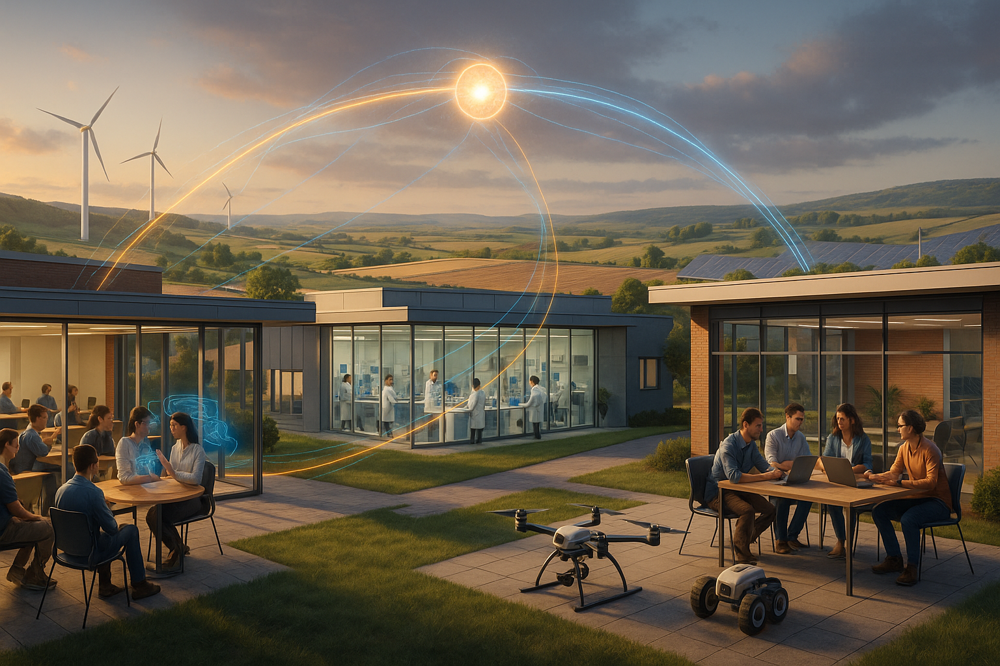

# Regional University – Research, Innovation & Entrepreneurship

## Metadata
- **Date created:** 2025-08-25  
- **Model/tool used:** DALL·E 3  
- **Style/parameters:** Photorealistic, cinematic, HDR  
- **Aspect ratio:** 16:9  
- **Tags:** #regionalUniversity #research #innovation #entrepreneurship  

---

## Prompt
```
A wide-angle, cinematic landscape scene depicting a modern regional university campus seamlessly integrated into its surrounding landscape (rolling hills, farmland, wind turbines, and solar panels in the distance). In the mid-ground, a research facility with glass walls shows scientists working with lab equipment, visible through the building. To the right, a startup incubator hub buzzes with activity: young entrepreneurs collaborating on laptops, a prototype drone and agricultural robot on display. To the left, a lecture theatre with students engaging in discussion, some with VR headsets or holographic interfaces. In the background, agricultural fields and renewable energy installations illustrate connection to regional industries. Subtle, glowing “data flows” (fine blue and gold light trails) visually link the three spaces (research, innovation, entrepreneurship), converging into a shared glowing node that hovers above the scene, symbolising integration. Style: photorealistic, natural light, optimistic and professional corporate mood, high dynamic range. Composition: rule-of-thirds, balanced between campus, innovation hub, and regional landscape. Exclude all text, watermarks, or logos. Aspect ratio: 16:9 (landscape).
```

---

## Image

