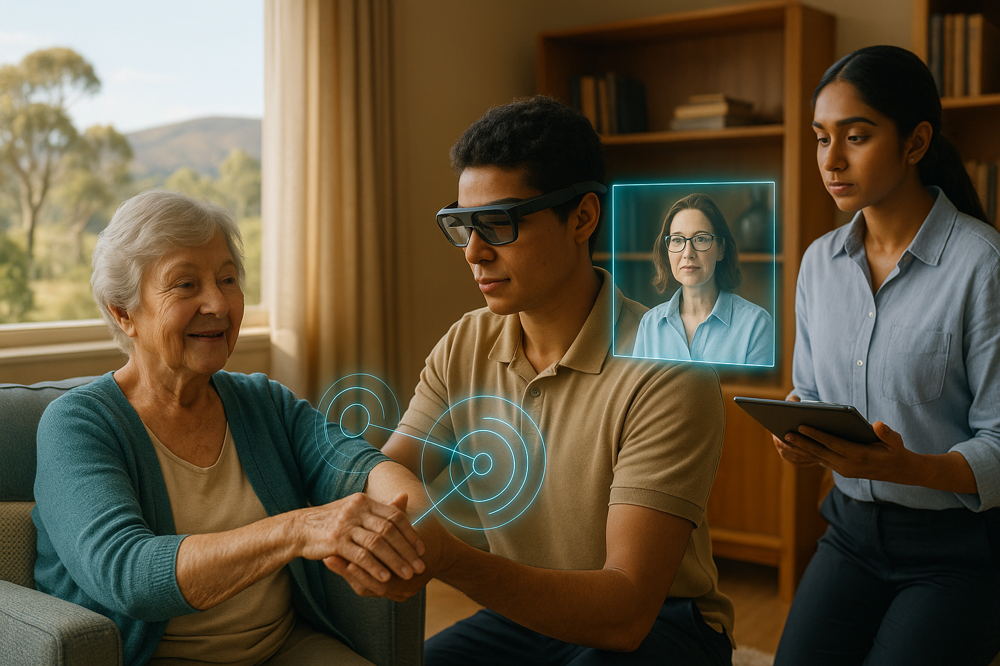

# The Future of Regional Care — Triple‑Threat Care Team (Image & Prompt)



> *Technology with a human touch: on‑the‑ground care fused with remote expertise and student learning.*

---

## Summary
This repository asset pairs a high‑resolution concept image with the full creative prompt so you (or collaborators) can regenerate, adapt, or document the visual. It portrays a **Triple‑Threat care team** delivering **technology‑enabled, human‑centred** support in regional Australia.

### Why this image?
- **Human first:** The therapeutic interaction is the focal point; technology is supportive.  
- **Regional specificity:** Australian landscape (gum trees, rolling hills) to ground the narrative in place.  
- **Workforce pipeline:** Practitioner, university expert, and student—hands, brains, and future talent working together.

---

## File
- **Image:** `./students_olderwoman.png` (2.5MB, 1536×1024px)  
- **Created:** 2025-09-07

---

## Prompt (for regeneration or adaptation)
1. **Core Scene – “The Future of Regional Care”**  
   A comfortable, light‑filled living room in a regional Australian town. Through the window: rolling hills and gum trees. The mood is warm, respectful, optimistic.

2. **Characters – Triple‑Threat Care Team**  
   - **Client (Problem Owner):** An older woman in her early 80s in an armchair—empowered and engaged.  
   - **On‑the‑Ground Practitioner (Hands):** A capable, empathetic worker in their 20s (e.g., TAFE AHA/junior health worker) wearing sleek smart glasses; performing a gentle range‑of‑motion assessment on the client’s arm.  
   - **Remote University Expert (Brains):** Appears as a semi‑transparent holographic video call beside the practitioner—an experienced Occupational Therapist in their 40s, guiding in real time.  
   - **University Student (Future Workforce):** A final‑year UNE Health Sciences student observing and recording data on a tablet.

3. **Innovation Element – Technology with a Human Touch**  
   - **Interface:** Subtle holographic overlay showing what the remote expert sees—clean, minimalist visuals (ROM angles, biometrics, clinical checklist).  
   - **Connection:** Thin, glowing lines linking the practitioner’s hands to the overlay, symbolising the fusion of hands‑on care and data‑driven expertise.

4. **Artistic Style & Technical Details**  
   - **Style:** Photorealistic concept art; cinematic; professional and human; suitable for a national health strategy report.  
   - **Lighting:** Soft, natural light; warm and optimistic.  
   - **Palette:** Warm, natural interiors (creams, soft woods, gentle blues) accented by non‑intrusive cyan/white UI elements.  
   - **Composition:** 16:9 landscape. Absolute focus on the respectful human interaction; technology supports rather than dominates.

**Keywords:** regional healthcare, aged care, telehealth, university‑industry collaboration, empathy, dignity, innovation, health‑tech, students, mentorship, occupational therapy, Australia, problem‑solving.

---

## Alt Text
> Older Australian woman receiving a gentle arm assessment from a young practitioner wearing smart glasses; holographic remote OT guidance and a UNE student observing with a tablet; warm regional home interior with gum trees seen through the window.

---

## Suggested Usage
- Place this image and markdown together in your repo (e.g., `/images/` folder).  
- Use the relative link below in README files, docs, or slide decks.  
- If publishing publicly, add an explicit **licence** section (e.g., CC BY 4.0) or your preferred terms for attribution and reuse.

---

## Red Flags to Avoid
- Keep the human interaction central; avoid turning the UI into the hero.  
- Avoid clinical coldness; maintain warmth and dignity.  
- Ensure “smart glasses” and holographic overlays remain subtle and consistent with the palette.

---

## Suggested Citation
> Smith, S. (2025). *The Future of Regional Care — Triple‑Threat Care Team*. Generated concept image and prompt. GitHub repository asset.

---

## Changelog
- **v1.0 (2025-09-07)** — Initial release of image and prompt.

---

## Metadata
```json
{
  "filename": "students_olderwoman.png",
  "dimensions": {
    "width": 1536,
    "height": 1024
  },
  "filesize_bytes": 2599734,
  "filesize_human": "2.5MB",
  "created_iso": "2025-09-07",
  "alt_text": "Older Australian woman receiving a gentle arm assessment from a young practitioner wearing smart glasses; holographic remote OT guidance and a UNE student observing with a tablet; warm regional home interior with gum trees seen through the window.",
  "caption": "Technology with a human touch: on\u2011the\u2011ground care fused with remote expertise and student learning.",
  "keywords": [
    "regional healthcare",
    "aged care",
    "telehealth",
    "university\u2011industry collaboration",
    "empathy",
    "dignity",
    "innovation",
    "health\u2011tech",
    "students",
    "mentorship",
    "occupational therapy",
    "Australia",
    "problem\u2011solving"
  ],
  "version": "v1.0"
}
```
